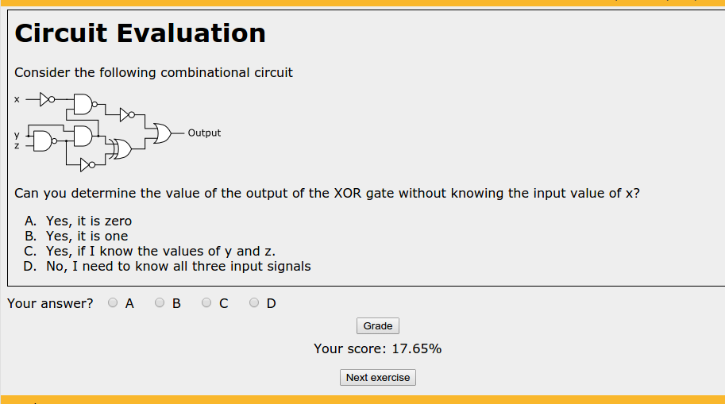

*************************************************
Multiple Choice Exercises for Sequential Delivery
*************************************************

This functionality is still relying on Sphinx to generate content, but it needs
and additional application to by fully deployed. The idea is to define a set of
exercises that can be answered as multiple choice questions, bundle them in an
entity called a *sequence* and have them delivered to the students in a
sequence. A random exercise is selected and shown, the answer captured and
graded. If the answer is correct, the exercise is no longer in the sequence
(will not be seen by the student). If incorrect, the exercise remains in the
sequence and a new one is randomly selected.

The effect of these sequences is that students keep repeating the exercises
that they answer incorrectly. The auxiliary platform (independent of the
authoring steps discussed here) keeps a score of the percentage of questions
that have been correctly answer so far. The following figure shows an example
of exercise as part of a sequence:

.. _Problem_sequence_capture:

	   
   Exercise in a Sequence where 17.56% of it has been correctly answered

The format to write these exercises is very similar to that discussed for the
:ref:`Embedded-MCQ`. This is how to write an exercise to be included in a
sequence::

  Circuit Evaluation
  ------------------

  Consider the following combinational circuit

  .. figure:: cdl_exc_circuit2.png
     :align: center
     :alt: Three input boolean circuit

  Can you determine the value of the output of the XOR gate without knowing the
  input value of x? 

  A) Yes, it is zero

  #) Yes, it is one

  #) Yes, if I know the values of y and z.

  #) No, I need to know all three input signals

  .. iguide:: Solution

     2

The result of this description is the exercise shown in the :ref:`previous
figure <Problem_sequence_capture>`. As you can see, the beginning of the
description is a regular section of reStructuredText, it even includes a
figure. The exercise description must conclude with an enumeration of the
answers (itemized list). Finally, the text is terminated by three special
lines. The first has fixed format, starts with two dots, a space, the word
*iguide* followed by two colons, and then the word *Solution*. The second is an
empty line, and the third contains only the number of the answer that is
correct **starting with zero for the first answer**. In the example, the
correct answer is the third one.

The authoring process of these exercises is a bit different. Each exercise must
be written in its own file and all of them in a separate folder from the
regular documents. This is because they need to be translated with different
format so that resulting HTML will then be taken by the sequencing application
as part of the algorithm that was previously described. 

If you want to start creating your own sequence of problems, create a new
folder and start creating the files for each exercise. If you go to the
location of the source code for this page, you will see a folder called
*Sample* that contains precisely a sample of files with a sequence of
exercises. The files will be processed by Sphinx, but with different settings,
thus, this is why this folder is being ignored while generating these
documents (see if you can find the location in the file `conf.py` where we tell
sphinx to ignore that folder.

