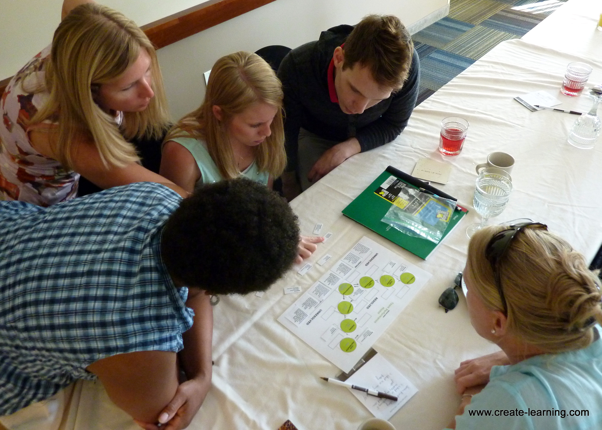

Creating Learning Resources with Sphinx-Doc
===========================================

   `Michael Cardus <https://www.flickr.com/photos/create-learning/9351356386>`_

This documentation serves two purposes. The first one is to show how to use
`sphinx-doc <http://sphinx-doc.org>`_ to create learning resources. Sphinx is a
toolkit that transforms a set of files written in `reStructuredText
<http://sphinx-doc.org/rest.html>`_ into a folder with a self-contained web
site. This resulting folder is locally stored in your computer, and you can see
its content with the browsers. If you want to make it available to your
students, you have to copy the folder to a remote location. If you use a
Learning Management System (LMS), see if it offers a way to upload a set of
files, or even better, to copy an entire folder (with sub-folders) remotely and
this folder can be made visible to students. Otherwise, you may need to find
some alternative to make the folder with the web site visible. 

The files resulting from the processing are formatted using the `Sphinx Read
the Docs Theme <http://docs.readthedocs.org/en/latest/theme.html>`_ which
provides a rendering that adapts to mobile devices. Once you make this
documentation available in a server, make sure you check it with a phone or a
tablet.

The basic functionality provided by sphinx that you can read about it has been
extended to include features that you may use in a learning environment. The
sections at the bottom of this document explain these extensions and how to use
them.

The second purpose of this document is to serve as a template. You may download
the files that make up this documentation, read about how to use Sphinx and
re-purpose it to your needs, perhaps transforming it into your own course
notes.

.. toctree::
   :maxdepth: 2

   /Embedded_questions/index
   /Videos/index
   /Sequences/index
   /Activity/index
   /Accordion_docs/index
   /Customize/index

We would like to hear about your experience using this authoring toolkit. Drop
us a note telling us what you think `by creating an issue in our issue tracker
<https://bitbucket.org/abelardopardo/reauthoring/issues/new>`_.

